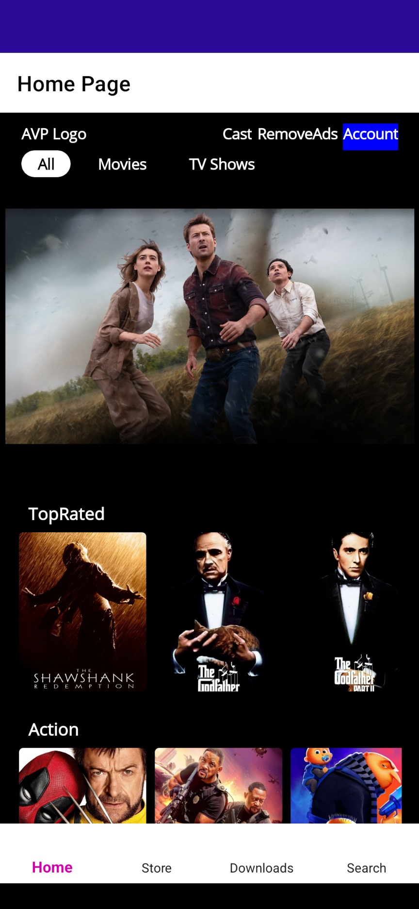
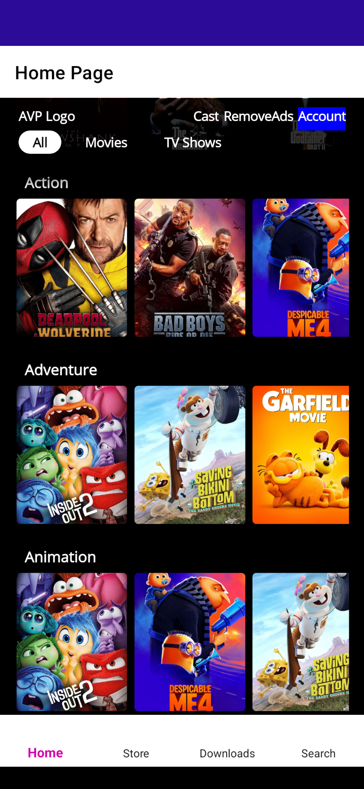
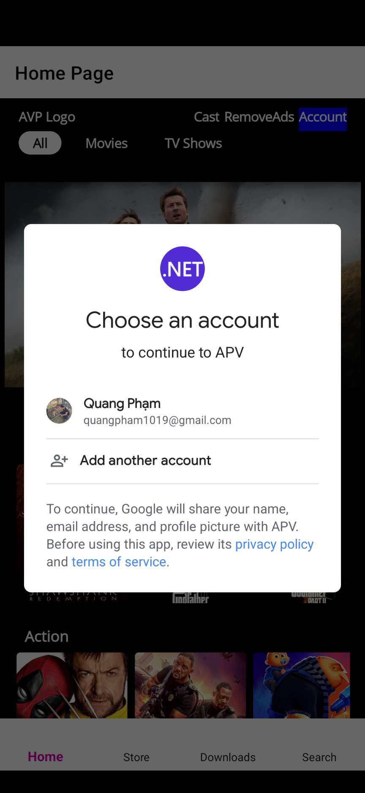
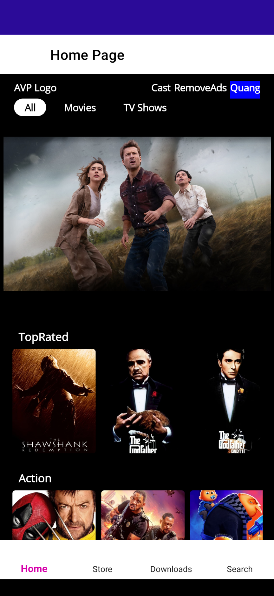
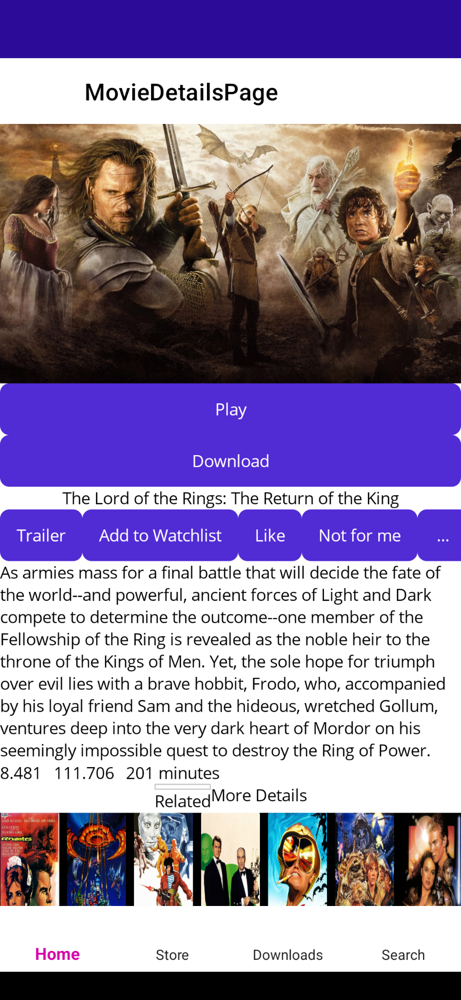
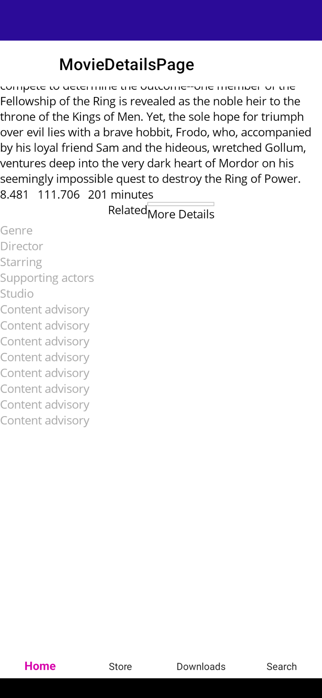
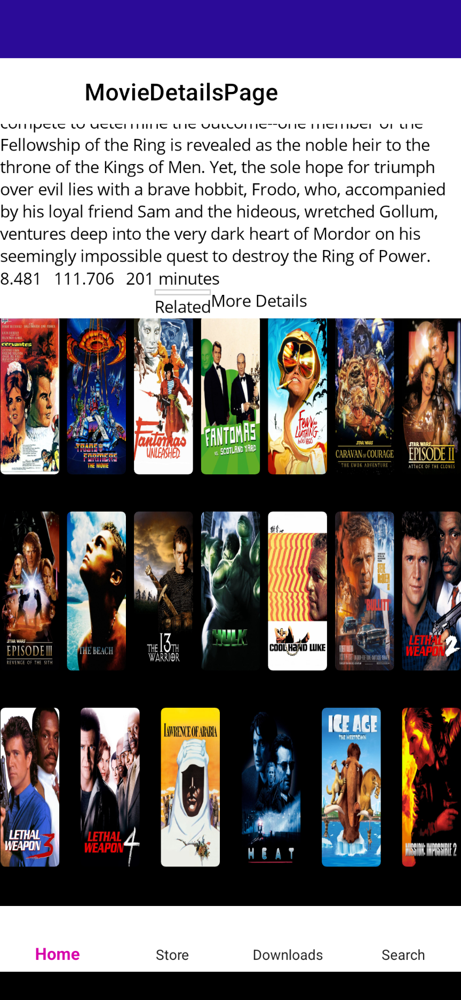
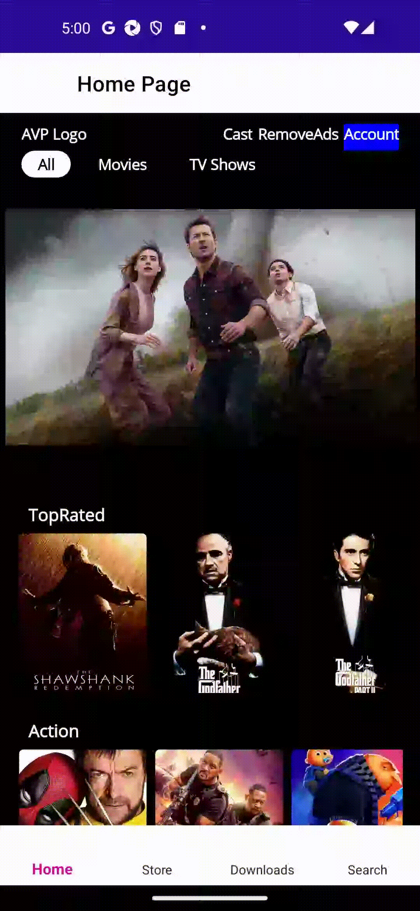
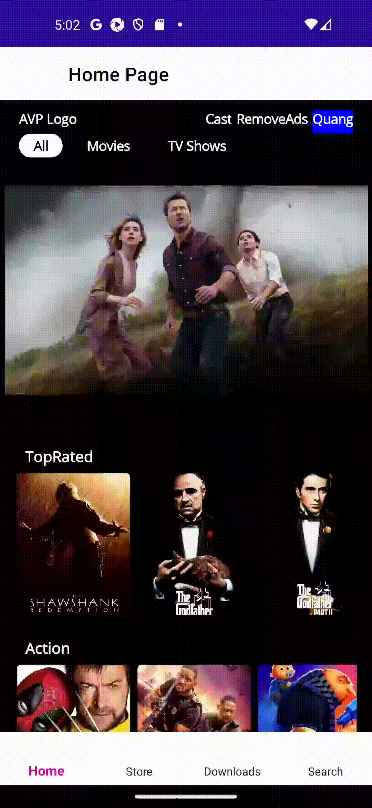

# **Amazon Prime Video (APV) Clone (.NET MAUI)**

- The application allows users to browse movies from a wide selection of categories (adventure, comedy, etc.), as well as top-rated and trending movies.
- Users can select a movie to view its details (overview, rating, runtime, etc.), as well as related movies.
- Users can log in using their Google account.

## **IN THE UPCOMING RELEASES**

- Update UI
- Integrate more OAuth sign-in options (Facebook, Apple, Instagram, etc.)
- Add store, downloads, and search function

## **PREVIEW**

#### **Home Page**

- Browsing through Homepage
    
- Sticky menu appear/disappear on scroll
    
- Movie Carousel
    

#### **Movie Details Page**

- Browsing through Movie Details page
    

#### **Login**

- Logging in
    
- Logging out
  - 
